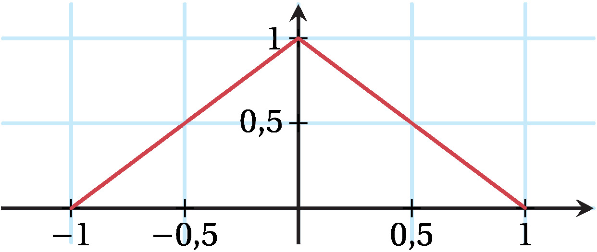
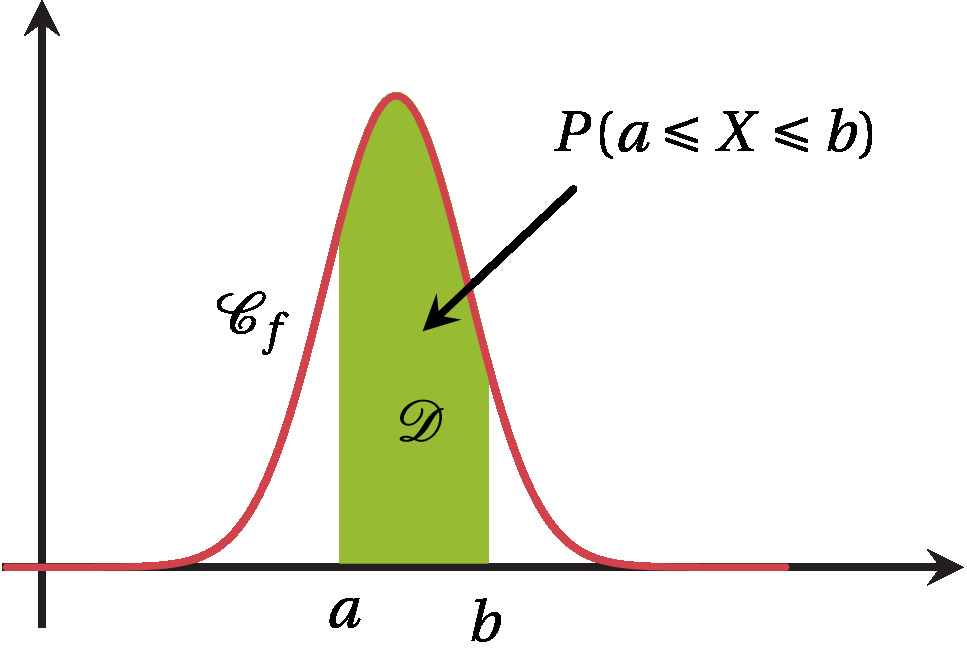
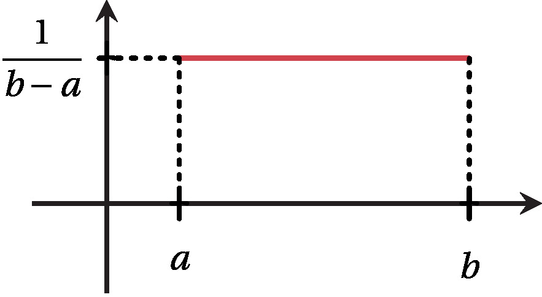
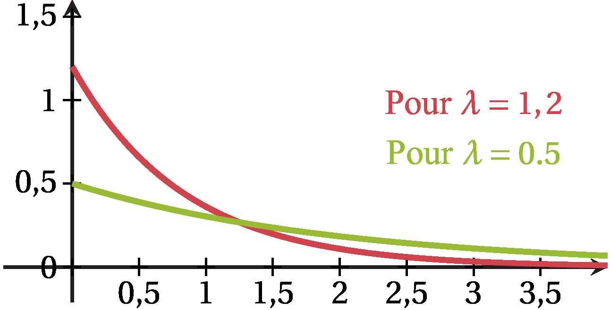
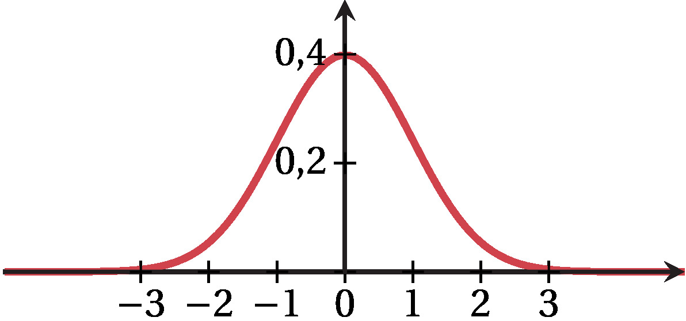
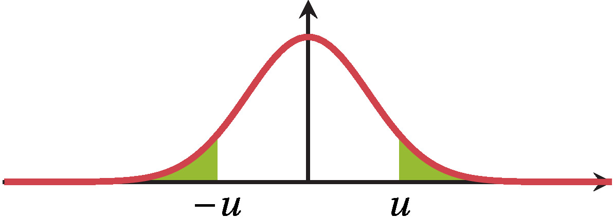
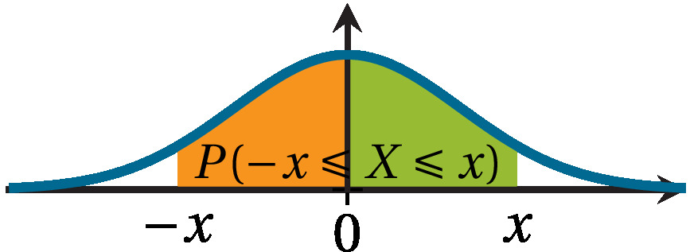
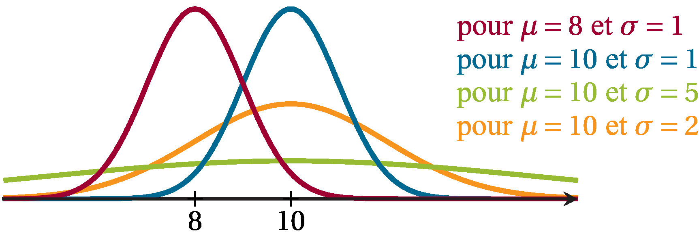

## Variables aléatoires à densité

:::tip Exemple:

Dans une bouteille vide de contenance 1,5 litres, on verse une quantité
au hasard d'eau. On considère la variable aléatoire $X$ égale à ce
volume d'eau en litres. Cette quantité peut être égale à n'importe quel
nombre de l'intervalle $\left[0\ ;\ 1,5 \right]$.

Cela signifie que $X$ prend ses valeurs dans l'intervalle
$\left[0\ ;\ 1,5 \right]$.

:::

:::tip Remarque:
Jusqu'à présent on a travaillé avec des variables aléatoires
**discrètes** qui prennent un nombre fini de valeurs et leur loi est
soit connue (binomiale ou Bernoulli), soit présentable sous la forme
d'un tableau. Dans l'exemple précédent, la variable aléatoire prend une
infinité de valeurs et toutes ces valeurs sont dans un intervalle de
$\R$.

:::

:::warning Définition:

Si une fonction $f$ définie sur un intervalle $I$ est continue et
positive sur $I$ et si l'aire du domaine compris entre l'axe des
abscisses et la courbe de $f$ sur l'intervalle $I$ est égale à 1 (unité
d'aire) alors on dit que $f$ est une **fonction de densité** (ou une
**densité de probabilité**).

:::

:::tip Exemple:

On considère la fonction $f$ définie sur $\left[-1\ ;\ 1 \right]$ par
$$
f(x)=\left\{
\begin{array}{l}
x+1 \textrm{ si } x\in\left[-1\ ;\ 0 \right[ \\
-x+1 \textrm{ si } x\in\left[0\ ;\ 1 \right]
\end{array}
\right.
$$

La fonction $f$ est positive et continue sur $\left[-1\ ;\ 1 \right]$.

De plus, le domaine entre la courbe de $f$ et l'axe des abscisses sur
$\left[-1\ ;\ 1 \right]$ est un triangle d'aire $\dfrac{2\times1}{2}=1$
: la fonction $f$ est donc une fonction de densité.

:::

:::warning Définition:

  

Soit $f$ une fonction de densité sur un intervalle $I$.

Dire que la variable aléatoire $X$ suit la loi de densité $f$ signifie
que pour tout intervalle $\left[a\ ;\ b \right]$ inclus dans $I$ on a
${P(a\leqslant X \leqslant b )=\textrm{aire}\left(\mathcal{D}\right)}$
où $\mathcal{D}$ est le domaine compris entre l'axe des abscisses, la
courbe de $f$ et les droites d'équation $x=a$ et $x=b$.

On a alors
$P(a \leqslant X \leqslant b)=\displaystyle \int_a^b f(t) \, \textrm{d}t$.

:::

:::tip Remarques:
-   On dit alors que $X$ est une **variable aléatoire à densité**.

-   La probabilité qu'une variable aléatoire à densité $X$ prenne une
    valeur $c$ est égale à 0 car
    $P(X=c)=\displaystyle \int_c^c f(t) \, \textrm{d}t=0$.

    Par conséquent, les éventuelles inégalités strictes peuvent être
    remplacées par des inégalités larges dans les calculs de
    probabilités : par exemple
    $P\left(1 < X \leqslant 3\right)=P\left(1 \leqslant X \leqslant 3\right)$.

:::

## Loi uniforme sur $\left[a\ ;\ b \right]$

:::warning Définition:

Une variable aléatoire $X$ suit **la loi uniforme sur
$\left[a\ ;\ b \right]$** si elle admet pour densité la fonction
constante $f$ définie sur $\left[a\ ;\ b \right]$ par
$f(x)=\dfrac{1}{b-a}$.

:::

:::tip Remarque

$X$ suit la loi uniforme sur $\left[a\ ;\ b \right]$ s'écrit aussi $X$
suit la loi $\mathcal{U}\left(\left[a\ ;\ b \right]\right)$ .

:::

:::warning Propriété

Soit $X$ une variable aléatoire suivant la loi uniforme sur
$\left[a\ ;\ b \right]$ et $\left[c\ ;\ d \right]$ un intervalle inclus
dans $\left[a\ ;\ b \right]$. Alors on a
$P\left(X\in\left[c\ ;\ d \right]\right)=\dfrac{d-c}{b-a}$.

:::

:::tip Preuve

$X$ admet pour densité $f:t\mapsto \dfrac{1}{b-a}$ sur
$\left[a\ ;\ b \right]$.

Donc on a
$P\left(X\in\left[c\ ;\ d \right]\right)=\displaystyle \int_{c}^{d} f(t) \, \textrm{d}t=\left[\dfrac{1}{b-a}t\right]_{c}^{d}=\dfrac{d-c}{b-a}$.

:::

:::warning Propriété:

On considère une variable aléatoire $X$ suivant la loi uniforme sur
$\left[a\ ;\ b \right]$ de densité $f$ et on appelle espérance
mathématique de $X$ le nombre
$E(X)=\displaystyle \int_{a}^{b} tf(t) \, \textrm{d}t$.

On a alors $E(X)=\dfrac{a+b}{2}$.

:::

:::tip Preuve:

On a
$E(X)=\displaystyle \int_{a}^{b} tf(t) \, \textrm{d}t=\displaystyle \int_{a}^{b} \dfrac{1}{b-a} t \, \textrm{d}t=\left[\dfrac{t^2}{2(b-a)}\right]_a^b=\dfrac{b^2-a^2}{2(b-a)}$

$=\dfrac{(b-a)(b+a)}{2(b-a)}=\dfrac{a+b}{2}$.

On utilise les différentes formules des propriétés ou on calcule à
l'aide de la fonction de densité et des intégrales.

:::

**Méthode  : Calculer une probabilité et une espérance pour une loi uniforme**

**Exercice:**

Armand et Lise rentrent de l'école à pied. Leurs parents savent qu'ils
doivent arriver entre 17h et 18h à la maison. On peut modéliser leur
heure d'arrivée par une variable aléatoire $X$ suivant la loi uniforme
sur $\left[17\ ;\ 18 \right]$.

**1.** Quelle est la probabilité qu'ils arrivent entre 17h et 17h15 ?

**2.** À quelle heure leurs parents peuvent-ils espérer les voir arriver
?

**Correction**

**1.** Sous forme décimale, 17h15$=17,25$h puis
$P(17\leqslant X \leqslant 17,25)=\dfrac{17,25-17}{18-17}=0,25$.

**2.** On a $E(X)=\dfrac{17+18}{2}=17,5$ donc leurs parents peuvent
espérer les voir arriver à 17h30.

:::tip Remarque:

Pour la question 1 de la méthode 1, comme
${f:t\mapsto \dfrac{1}{18-17}=1}$ sur $\left[17\ ;\ 18 \right]$ est la
fonction de densité de $X$, on aurait aussi pu calculer
${P(17\leqslant X \leqslant 17,25)=\displaystyle \int_{17}^{17,25} 1 \, \textrm{d}t=\left[t\right]_{17}^{17,25}=17,25-17=0,25}$.

:::

## Loi exponentielle de paramètre $\lambda$ ($\lambda>0$)

:::warning Définition:

Une variable aléatoire $X$ suit la **loi exponentielle de paramètre**
$\lambda$ où $\lambda>0$ si elle admet pour densité la fonction $f$
définie sur $\left[0\ ;\ +\infty \right[$ par
$f(x)=\lambda\textrm{e}^{-\lambda x}$.

  

:::

:::tip Remarque:

$X$ suit la loi exponentielle de paramètre $\lambda$ s'écrit aussi $X$
suit la loi $\mathcal{E}\left(\lambda\right)$ .

:::

:::warning Propriété:

Soit $X$ une variable aléatoire suivant la loi
$\mathcal{E}\left(\lambda\right)$ et $a$, $c$ et $d$ trois réels
positifs. On a alors :

-   ${P\left(c\leqslant X\leqslant d\right)=\textrm{e}^{-\lambda c}-\textrm{e}^{-\lambda d}}$

-   $P\left(X \leqslant a \right)=1-\textrm{e}^{-\lambda a}$

-   $P\left(X \geqslant a \right)=\textrm{e}^{-\lambda a}$

:::

:::tip Preuve:

-   Pour tous réels $c$ et $d$ positifs, on a
    $P(c\leqslant X \leqslant d)=\displaystyle \int_{c}^{d} \lambda\textrm{e}^{-\lambda t} \, \textrm{d}t=\left[-\textrm{e}^{-\lambda t}\right]_{c}^{d}$
    ${=-\textrm{e}^{-\lambda d}-\left(-\textrm{e}^{-\lambda c}\right)=\textrm{e}^{-\lambda c}-\textrm{e}^{-\lambda d}}$.

-   En prenant $c=0$ et $d=a$ dans le résultat précédent, on trouve
    $P\left(X \leqslant a \right)=P\left(0 \leqslant X \leqslant a \right)$
    ${=\textrm{e}^{-\lambda \times 0}-\textrm{e}^{-\lambda a}=1-\textrm{e}^{-\lambda a}}$.

-   On a
    $P\left(X \geqslant a \right)=1-P\left(X<a\right)=1-P\left(X\leqslant a\right)=1-\left(1-\textrm{e}^{-\lambda a}\right)=\textrm{e}^{-\lambda a}$.

:::

:::warning Propriété:

On considère une variable aléatoire $X$ suivant la loi exponentielle de
paramètre $\lambda$ de densité $f$ et on appelle espérance mathématique
de $X$ le nombre
$E(X)=\displaystyle \lim_{x \rightarrow +\infty} \int_{0}^{x} tf(t) \, \textrm{d}t$.

On a alors $E(X)=\dfrac{1}{\lambda}$.

:::

:::tip Preuve:

La fonction $f$ est définie sur $\left[0\ ;\ +\infty \right[$ par
$f(t)=\lambda\textrm{e}^{-\lambda t}$.

Posons alors pour tout réel $t$ positif
$g(t)=tf(t)=t\lambda\textrm{e}^{-\lambda t}$ : il s'agit alors de
connaître une primitive de $g$ pour calculer l'intégrale.

La fonction $G$ définie sur $\left[0\ ;\ +\infty \right[$ par
$G(t)=\left(-t-\dfrac{1}{\lambda}\right)\textrm{e}^{-\lambda t}$ est une
primitive de $g$.

En effet
$G'(t)=-1\times \textrm{e}^{-\lambda t} + \left(-t-\dfrac{1}{\lambda}\right)\times \left(-\lambda \textrm{e}^{-\lambda t}\right)=-\textrm{e}^{-\lambda t} + \lambda t \textrm{e}^{-\lambda t} + \textrm{e}^{-\lambda t} = \lambda t \textrm{e}^{-\lambda t}$.

On a alors
${\displaystyle\int_{0}^{x} tf(t) \, \textrm{d}t = \left[G(t)\right]_0^x=\left(-x-\dfrac{1}{\lambda}\right)\textrm{e}^{-\lambda x}-\left(-0-\dfrac{1}{\lambda}\right)\textrm{e}^{-\lambda 0}=-x\textrm{e}^{-\lambda x}-\dfrac{1}{\lambda}\textrm{e}^{-\lambda x}+\dfrac{1}{\lambda}}$.

On a donc
$E(X) = \displaystyle \lim_{x \rightarrow +\infty} -x\textrm{e}^{-\lambda x}-\dfrac{1}{\lambda}\textrm{e}^{-\lambda x}+\dfrac{1}{\lambda}=\displaystyle \lim_{x \rightarrow +\infty} \dfrac{-\lambda x\textrm{e}^{-\lambda x}}{\lambda}-\dfrac{1}{\lambda}\textrm{e}^{-\lambda x}+\dfrac{1}{\lambda}$.

Comme $\lambda>0$,
$\displaystyle \lim_{x \rightarrow +\infty} -\lambda x=-\infty$ :

-   par composition, on a
    $\displaystyle \lim_{x \rightarrow +\infty} \textrm{e}^{-\lambda x}=0$.

-   par composition et croissance comparée, on a
    $\displaystyle \lim_{x \rightarrow +\infty} -\lambda x \textrm{e}^{-\lambda x}=0$.

Finalement, on obtient bien
$E(X) = \displaystyle \lim_{x \rightarrow +\infty} \dfrac{-\lambda x\textrm{e}^{-\lambda x}}{\lambda}-\dfrac{1}{\lambda}\textrm{e}^{-\lambda x}+\dfrac{1}{\lambda}=\dfrac{1}{\lambda}$.

:::

**Méthode: Calculer avec une loi exponentielle**

**Exercice:**

On considère que le temps d'attente en minutes à un guichet du service
après-vente d'un magasin peut être modélisé par une variable aléatoire
$T$ suivant la loi exponentielle de paramètre 0,2.

**1.** Calculer au millième près la probabilité d'attendre un temps
inférieur ou égal à 5 minutes.

**2.** Calculer au millième près la probabilité d'attendre plus de 10
minutes.

**3.** Un client se présente au guichet. Quel temps peut-il espérer
attendre ?

**Correction**

**1.** On calcule
$P(0\leqslant T \leqslant 5)=1-\textrm{e}^{-0,2\times 5}=1-\textrm{e}^{-1}\approx 0,632$.

**2.** On calcule
$P(T \geqslant 10)=\textrm{e}^{-0,2 \times 10}=\textrm{e}^{-2}\approx 0,135$.

**3.** $E(T)=\dfrac{1}{0,2}=5$ donc le client peut espérer attendre 5
minutes.

:::tip Remarque:

Dans le cas de la première probabilité, un calcul d'intégrale était
envisageable : la fonction de densité de $T$ est la fonction définie sur
$\left[0\ ;\ +\infty \right[$ par $f(t)=0,2\textrm{e}^{-0,2t}$.

La probabilité d'attendre un temps inférieur ou égal à 5 minutes est
donc :

$P(0\leqslant T \leqslant 5)=\displaystyle \int_{0}^{5} 0,2\textrm{e}^{-0,2t} \, \textrm{d}t=\left[-\textrm{e}^{-0,2t}\right]_{0}^{5}=-\textrm{e}^{-0,2\times5}-\left(-\textrm{e}^{-0,2\times0}\right)=1-\textrm{e}^{-1}\approx 0,632$.

:::

**Méthode: Déterminer le paramètre λ d’une loi exponentielle**

Dans les cas où une information (probabilité ou espérance) peut être
exploitée, on pose l'équation issue des formules du cours et on résout
cette équation pour déterminer $\lambda$.

**Exercice:**

Soit $X$ une variable aléatoire suivant la loi $\mathcal{E}(\lambda)$
avec $P(X\leqslant 5)=0,2$. Déterminer $\lambda$.

**Correction**

D'après l'énoncé, on a $P(X\leqslant 5)=0,2$ donc
$1-\textrm{e}^{-5 \lambda }=0,2$.

Résolvons donc cette équation :
$1-\textrm{e}^{-5\lambda }=0,2 \Leftrightarrow \textrm{e}^{-5\lambda }=0,8 \Leftrightarrow \ln\left(\textrm{e}^{-5\lambda}\right)=\ln(0,8)$

$\Leftrightarrow -5\lambda=\ln(0,8)$ donc
$\lambda = \dfrac{\ln(0,8)}{-5}\approx 0,045$.

:::warning Propriété:

Soit $X$ une variable aléatoire suivant une loi exponentielle de
paramètre $\lambda>0$ et deux nombres $t>0$ et $h>0$.

La probabilité conditionnelle $P_{(X>t)}\left(X>t+h\right)$ est égale à
la probabilité $P(X>h)$.

On dit que la loi exponentielle est **sans vieillissement** ou **avec
absence de mémoire**.

:::

:::tip Preuve

Par définition, on a :
$P_{(X>t)}(X>t+h)=\dfrac{P((X>t)\cap (X>t+h))}{P(X>t)}$

$=\dfrac{P(X>t+h)}{P(X>t)}=\dfrac{\textrm{e}^{-\lambda(t+h)}}{\textrm{e}^{-\lambda t}}=\dfrac{\textrm{e}^{-\lambda t} \times \textrm{e}^{-\lambda h}}{\textrm{e}^{-\lambda t}}=\textrm{e}^{-\lambda h}=P(X>h)$.

:::

:::tip Exemple:

On considère un appareil dont la durée de vie en années suit la loi
exponentielle de paramètre 0,05 : d'après la propriété,
$P_{(X>4)}\left(X>9\right)=P_{(X>4)}\left(X>4+5\right)=P(X>5)$.

Concrètement, si l'appareil a déjà fonctionné 4 ans, la probabilité
qu'il fonctionne encore 5 ans de plus est égale à la probabilité (non
conditionnelle) qu'il fonctionne plus de 5 ans.

:::

## Lois normales

### Loi normale centrée réduite $\mathcal{N}(0\ ;\ 1)$

:::warning Définition:

Une variable aléatoire est centrée lorsque son espérance vaut $0$ et
elle est réduite lorsque son écart-type vaut $1$.

:::

:::warning Théorème : Théorème de Moivre­Laplace

Soit $X_n$ une variable aléatoire suivant une loi binomiale
$\mathcal{B}(n\ ;\ p)$ et $Z=\cfrac{X_n-np}{\sqrt{np(1-p)}}$, variable
aléatoire centrée réduite. Alors pour tous réels $a$ et $b$ tels que
$a\leqslant b$, on a :

$$\lim_{n\rightarrow +\infty}P(a\leqslant
Z\leqslant b)=\int_a^b \dfrac{1}{\sqrt{2\pi}}
\textrm{e}^{-\dfrac{x^2}{2}} \textrm{d} x.$$

:::

  

:::warning Définition:

Une variable aléatoire $X$ suit la **loi normale centrée réduite**
$\mathcal{N}(0\ ;\ 1)$ si elle admet pour densité la fonction $f$ (dont
la courbe est donnée ci-contre) définie sur $\R$ par :

$$f(x)=\dfrac{1}{\sqrt{2\pi}}\textrm{e}^{-\dfrac{x^2}{2}}.$$

Autrement dit, pour tous réels $a$ et $b$ tels que $a\leqslant b$, on a: 

$$
P(a\leqslant X\leqslant b)=\displaystyle
\int_a^b \cfrac{1}{\sqrt{2\pi}}\text{ e}^{-\dfrac{x^2}{2}}\textrm{d} x.
$$

:::

:::tip Remarque

Comme on ne peut pas calculer l'intégrale à l'aide d'une primitive (car
cette fonction de densité n'en admet pas d'explicite), on utilise une
calculatrice pour calculer des probabilités de la forme
$P(a\leqslant X\leqslant b)$ ou pour trouver un nombre $x$ tel que
$P(X\leqslant x)=p$ avec $p$ donné .

:::

:::warning Propriété:

Soit $f$ : $x\mapsto \cfrac{1}{\sqrt{2\pi}}\text{ e}^{-\dfrac{x^2}{2}}$
la fonction de densité d'une variable aléatoire suivant la loi
$\mathcal{N}(0\ ;\ 1)$.

-   L'aire totale entre
    la courbe représentant la fonction de densité $f$ et l'axe des abscisses est $1$.

-     

    $f$ est une fonction paire, donc sa courbe représentative est
    symétrique par rapport à l'axe des ordonnées.

    Par un argument de symétrie, pour tout réel $u$, on a :

    $$P(X\leqslant -u)=P(X\geqslant u).$$

    

:::

:::tip Remarque:

Pour $u=0$, on a $P(X\leqslant 0)=P(X\geqslant 0)=0,5$.

:::

:::warning Propriété:

Soit $X$ une variable aléatoire suivant la loi normale centrée réduite
$\mathcal{N}(0\ ;\ 1)$, de fonction de densité $f$. Alors

-   $E(X)=\displaystyle \lim_{x \rightarrow -\infty}
    \int_x^0 tf(t)\textrm{d} t+ \displaystyle \lim_{y
    \rightarrow +\infty} \int_0^y tf(t)\textrm{d} t=0$

   

-    $V(X)=1$ et $\sigma(X)=1$.

:::

**Méthode: Calculer avec la loi centrée réduite**

Soit $X$ une variable aléatoire suivant la loi normale centrée réduite
$\mathcal{N}(0\ ;\ 1)$.

**1.** À l'aide d'une calculatrice, déterminer une valeur approchée au
millième de :

**1.a)** $P(2\leqslant X\leqslant 3)$

**1.b)** $P(X\leqslant 0,7)$

**1.c)** $P(X>-0,2)$

**2.**

**2.a)** Déterminer $t$ tel que $P(X\leqslant t)=0,25$.

**2.b)** Déterminer $u$ tel que $P(X>u)=0,4$.

**Correction**

**1.**

**1.a)**

[**Calculatrice TI**]{style="color: H1"}

-   On accède au menu **distrib** en appuyant sur la touche **2nd** puis
    la touche **VAR**

-   On choisit `NormalFrep(` et on écrit `NormalFrep(2,3,0,1)`.

[**Calculatrice Casio**]{style="color: H1"}

-   Dans le menu **RUN**, on appuie sur **OPTN** puis **STAT** puis
    **DIST** puis **NORM** puis **Ncd**.

-   On écrit alors `NormCD(2,3,1,0)`.

On obtient $P(2\leqslant X\leqslant 3)\approx0,021$.

**1.b)**   

La calculatrice donne $P(0\leqslant X\leqslant 0,7)\approx 0,258$ donc

$P(X\leqslant 0,7)=P(X<0)+P(0\leqslant X\leqslant 0,7)$

$\approx 0,5+0,258=0,758$.

**1.c)**   

La calculatrice donne $P(-0,2<X<0)\approx 0,079$ donc
$P(X>-0,2)=P(-0,2<X<0)+P(X\geqslant 0)$

$\approx 0,079+0,5=0,579$.

**2.**

**2.a)**

[**Calculatrice TI**]{style="color: H1"}

-   Dans le menu **distrib**,

    on choisit `FracNormale(` et on écrit `FracNormale(0.25,0,1)`.

[**Calculatrice Casio**]{style="color: H1"}

-   Dans le menu

    **STAT** \> **DIST** \> **NORM**, on choisit **InvN** et on écrit
    `InvNormCD(0.25,1,0)`.

On obtient $t\approx -0,674$.

**2.b)**   

$P(X>u)=0,4 \Leftrightarrow P(X\leqslant u)=0,6$.

On trouve $u\approx 0,253$.

  

:::warning Théorème:

Soit $X$ une variable aléatoire suivant la loi normale centrée réduite
$\mathcal{N}(0\ ;\ 1)$ et $\alpha\in ]0\ ;\ 1[$. Alors il existe un
unique réel $u_{\alpha}>0$ tel que
$P(-u_{\alpha}\leqslant X\leqslant u_{\alpha})=1-\alpha$.

:::

:::tip Preuve

Soit $\alpha\in]0\ ;\ 1[$, on a alors $1-\alpha\in]0\ ;\ 1[$.

Sur $[0\ ;\ +\infty[$, soit
$f:x\mapsto P(-x\leqslant X\leqslant x)=2P(0\leqslant X\leqslant x)=2\displaystyle\int_{0}^{x}\dfrac{1}{\sqrt{2\pi}}\textrm{e}^{-\cfrac{t^2}{2}}\textrm{d}t$

par symétrie de la fonction de densité de la loi $\mathcal{N}(0\ ;\ 1)$.

Comme
$g:x\mapsto \displaystyle\int_{0}^{x}\dfrac{1}{\sqrt{2\pi}}\textrm{e}^{-\cfrac{t^2}{2}}\textrm{d} t$
est une primitive de
$t\mapsto \dfrac{1}{\sqrt{2\pi}}\textrm{e}^{-\cfrac{t^2}{2}}$ :

-   $f=2g$ est dérivable donc **continue** sur $[0\ ;\ +\infty[$ ;

-   $f'(x)=2g'(x)=\dfrac{2}{\sqrt{2\pi}}\textrm{e}^{-\cfrac{x^2}{2}}>0$
    donc $f$ est **strictement croissante** sur $[0\ ;\ +\infty[$.

De plus, $f(0)=P(-0\leqslant X\leqslant 0)=P(X=0)=0$,
${\displaystyle\lim_{x\rightarrow +\infty} f(x)=\lim_{x\rightarrow
+\infty} P(-x\leqslant X\leqslant x)=1}$ par définition d'une loi à
densité. Comme $\mathbf{1-}\alpha\mathbf{\in[0\ ;\ 1[}$, d'après le
théorème de bijection, l'équation $f(x)=1-\alpha$ admet une unique
solution notée $u_{\alpha}$ sur $[0\ ;\ +\infty[$ c'est-à-dire qu'il
existe un unique réel $u_{\alpha}> 0$ tel que
$P(-u_{\alpha}\leqslant X\leqslant u_{\alpha})=1-\alpha$.

:::

:::tip Valeurs particulières:

En particulier, $u_{0,05} \approx 1,96$ et $u_{0,01}\approx 2,58$.

Autrement dit, $P(-1,96\leqslant X\leqslant 1,96)\approx 0,95$ et
$P(-2,58\leqslant X\leqslant 2,58)\approx 0,99$.

:::

### Lois normales $\mathcal{N}(\mu\ ;\ \sigma^2)$

:::warning Définition:

Soit $\mu$ et $\sigma$ deux réels avec $\sigma>0$. On dit qu'une
variable aléatoire $X$ suit la **loi normale
$\mathcal{N}(\mu\ ;\ \sigma^2)$** si $Z=\cfrac{X-\mu}{\sigma}$ suit la
loi normale centrée réduite $\mathcal{N}(0\ ;\ 1)$.

:::

-   Il en résulte que si $X$ suit la loi $\mathcal{N}(0\ ;\ 1)$ alors
    $\mu+\sigma X$ suit la loi $\mathcal{N}(\mu\ ;\ \sigma^2)$.

-   Si $X$ suit la loi $\mathcal{N}(\mu\ ;\ \sigma^2)$, alors sa densité
    $f$ est donnée par
    ${f(x)=\cfrac{1}{\sigma\sqrt{2\pi}}\textrm{ e}^{-\cfrac{(x-\mu)^2}{2\sigma^2}}}$.

    La courbe de $f$ est appelée **gaussienne** et est symétrique par
    rapport à la droite d'équation $x=\mu$ ce qui permet d'en déduire
    des probabilités par symétrie autour de $\mu$.

    

**1.** Soit $X$ une variable aléatoire suivant la loi
$\mathcal{N}(7\ ;\ 2^2)$.

À l'aide d'une calculatrice, déterminer une valeur approchée au millième
de :

**1.a)** $P(6\leqslant X\leqslant 9)$

**1.b)** $P(X<10)$

**1.c)** $P(X\geqslant 8)$

**2.** Soit $Y$ une variable aléatoire suivant la loi
$\mathcal{N}(6\ ;\ 3^2)$.

À l'aide d'une calculatrice, déterminer une valeur approchée au millième
de :

**2.a)** $t$ tel que $P(Y<t)=0,95$.

**2.b)** $u$ tel que $P(Y\geqslant u)=0,1$.

**Correction**

**1.**

**1.a)** On entre `NormalFrep(6,9,7,2)` ou `NormCD(6,9,2,7)` selon le
modèle de calculatrice et on obtient
$P(6\leqslant X\leqslant 9)\approx 0,533$.

**1.b)**   

-   Une calculatrice donne $P(7<X<10)\approx 0,433$ donc
    $P(X<10)=P(X\leqslant 7)+P(7<X<10)$

    $\approx 0,5+0,433=0,933$.

-   Pour calculer $P(X<a)$, on peut aussi calculer
    $P\left(-10^{99}\leqslant X<a \right)$ avec une calculatrice. On
    obtient alors $P\left(-10^{99}\leqslant X< 10 \right)\approx0,933.$

**1.c)**   

-   La calculatrice donne $P(7\leqslant X<8)\approx 0,191$ donc
    $P(X\geqslant 8)=P(X\geqslant 7)-P(7\leqslant X < 8)$

    $\approx 0,5-0,191=0,309$.

-   Pour calculer $P(X\geqslant a)$, on peut aussi calculer
    $P\left(a\leqslant X\leqslant 10^{99}\right)$ avec une calculatrice.
    on obtient alors
    $P\left(8\leqslant X\leqslant 10^{99} \right)\approx0,309.$

**2.**

**2.a)** On entre `FracNormale(0.95,6,3)` ou `InvNormCD(0.95,3,6)` selon
le modèle de calculatrice et on obtient $t\approx 10,935$.

**2.b)**   

On a $P(X\geqslant u)=0,1 \Leftrightarrow P(X<u)=0,9$.

Une calculatrice donne $u\approx 9,845$.

  

Ces méthodes utilisant le fait que
$P(X\leqslant a)\approx P(-10^{99}\leqslant X\leqslant a)$
et$P(X\geqslant a)\approx P(a\leqslant X\leqslant 10^{99})$ peuvent
également être utilisées dans le cas particulier de la loi normale
centrée réduite $\mathcal{N}(0\ ;\ 1)$.

Soit $X$ une variable aléatoire suivant la loi normale
$\mathcal{N}(\mu\ ;\ \sigma^2)$. On a alors :

2

$E(X)=\mu$ ;

$V(X)=\sigma^2$ et $\sigma(X)=\sigma$.

-   Plus $\sigma$ est petit, plus les valeurs prises par $X$ sont
    concentrées autour de la moyenne.

    

-   On peut considérer que sous certaines conditions (par exemple
    ${n\geqslant30}$, ${np\geqslant 5}$ et ${n(1-p)\geqslant5}$), la loi
    $\mathcal{N}(np\ ;\ \sqrt{np(1-p)}^2)$ approxime convenablement la
    loi $\mathcal{B}(n\ ;\ p)$.

Centrer et réduire une variable aléatoire suivant une loi normale de
paramètre(s) inconnu(s) permet de travailler avec la loi connue
$\mathcal{N}(0\ ;\ 1)$.

On modélise par une
loi normale d'espérance $\mu$ et d'écart-type $\sigma$ le temps $T$ (en
secondes) mis par un sportif amateur pour parcourir un 100 mètres.

Ce sportif a remarqué qu'il mettait en moyenne $13$ secondes à parcourir
la distance, et qu'il arrivait à descendre en dessous des $12$ secondes
pour $5\%$ des courses.

Déterminer les valeurs de $\mu$ et $\sigma$.

**Correction**

-   Le temps moyen pour parcourir 100 mètres est de $13$ secondes donc
    l'espérance $\mu$ vaut $13$.

-   On sait de plus que $P(T\leqslant 12 )=0,05$.

    Posons $Z=\dfrac{T-13}{\sigma}$, la variable aléatoire $Z$ suit
    alors la loi normale centrée réduite.

    De plus,
    $T\leqslant 12 \Leftrightarrow \dfrac{T-13}{\sigma}\leqslant  \dfrac{-1}{\sigma}$
    d'où
    $P(T\leqslant 12 )=P\left(Z\leqslant \dfrac{-1}{\sigma}\right)=0,05$.

    Or, à l'aide d'une calculatrice, on trouve que le réel $u$ tel que
    $P(Z\leqslant u)=0,05$ vaut approximativement $-1,645$ donc
    $\dfrac{-1}{\sigma}\approx-1,645$ et
    $\sigma\approx\cfrac{1}{1,645}\approx0,608$.

  

Soit $X$ une variable aléatoire suivant la loi normale
$\mathcal{N}(\mu\ ;\ \sigma^2)$. On a alors :

-   $P(X\in[\mu-\sigma\ ;\ \mu+\sigma])=P(\mu-\sigma\leqslant X\leqslant \mu+\sigma)\approx0,68$
    ;

-   $P(X\in[\mu-2\sigma\ ;\ \mu+2\sigma])=P(\mu-2\sigma\leqslant X\leqslant \mu+2\sigma)\approx0,954$
    ;

-   $P(X\in[\mu-3\sigma\ ;\ \mu+3\sigma])=P(\mu-3\sigma\leqslant X\leqslant \mu+3\sigma)\approx0,997$.

Graphiquement, on a alors :

où l'aire du domaine en bleu est environ 0,68, l'aire du domaine en bleu
et vert est environ 0,954 et l'aire du domaine en bleu, vert et orange
(jusqu'à $\mu-3\sigma$ et $\mu+3\sigma$) est environ 0,997.

  