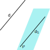
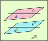
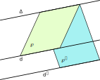
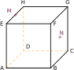
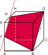

## Parallélisme dans l'espace

::: warning Propriété 

+  Si deux droites sont parallèles à une même droite alors elles
sont parallèles entre elles.

+  Si deux plans sont parallèles à un même plan alors ils sont
parallèles entre eux.

:::

::: warning Propriété 
Une droite est parallèle à un plan si et seulement si elle est
parallèle à une droite de ce plan.
:::

::: tip Exemple

$d$ est parallèle à $d_1$ et $d_1$ est contenue dans le plan $\wp$
donc $d$ est parallèle à $\wp$.

:::

::: warning Propriété 
Si un plan $\wp$ contient deux droites sécantes respectivement
parallèles à deux droites sécantes d' un plan $\wp'$ alors les plans
$\wp$ et $\wp'$ sont parallèles.
:::

::: tip Exemple 
$d_1$ et $d_2$ sont deux droites du plan $\wp$ ; $d_1$ et $d_2$
sont sécantes et respectivement parallèles à deux droites du plan
$\wp'$ donc les plans $\wp$ et $\wp'$ sont parallèles.

:::

::: warning Propriété 
Si deux plans sont parallèles, alors tout plan qui coupe l'un coupe
l'autre et les droites d'intersection sont parallèles entre elles.
:::

::: tip Exemple 
Les plans $\wp$ et $\wp'$ sont parallèles et $\wp$ et $\wp''$ sont
sécants avec $\wp\cap\wp''=d$, donc $\wp'$ et $\wp''$ sont sécants
et $\wp'\cap\wp''=d'$ où $d'$ est une droite parallèle à $d$.

:::

::: warning Propriété  [Théorème du toit]

Soit $\wp$ et $\wp'$ deux plans distincts, sécants selon une
droite $\Delta$.

Si une droite $d$ de $\wp$ est strictement parallèle à une droite
$d'$ de $\wp'$ alors la droite $\Delta$ intersection de $\wp$ et
$\wp'$ est parallèle à $d$ et à $d'$.

:::

::: tip Preuve 
Par hypothèse, $\wp\cap\wp'=\Delta$ et $d//d'$. Les droites $d$ et
$d'$ sont parallèles donc elles sont coplanaires. Donc, il existe un
plan $Q$ qui contient à la fois $d$ et $d'$. Mais alors $d$ et
$\Delta$ sont contenues dans $\wp$ et $d'$ et $\Delta$ sont
contenues dans $\wp'$. Donc : $\wp\cap Q=d$ et $\wp'\cap Q=d'$.

Montrons que $d//\Delta$.
Supposons que $d$ et $\Delta$ ne soient pas parallèles. Donc elles
sont sécantes en un point $A$.

$A\in d$ et $A\in\Delta$.

+  $A\in d$ et $d=\wp\cap Q$ donc $A\in Q$.

+  $A\in\Delta$ et $\Delta=\wp\cap\wp'$ donc $A\in\wp'$.  D'où
$A\in Q\cap\wp'=d'$.

Par conséquent, $A\in d'$ et $A\in d$ et par conséquent, $d$ et $d'$
sont sécantes en A.
Ce qui est absurde, contraire à notre hypothèse.

Les droites $d$ et $\Delta$ sont donc parallèles.  De plus, comme
$d$ et $d'$ sont parallèles, on en déduit que les droites $d'$ et
$\Delta$ sont aussi parallèles.

**Conclusion :** L'intersection de $\wp$ et $\wp'$ est une
droite $\Delta$ parallèle à la fois à $d$ et à $d'$.
:::

::: tip Méthode [Construire la section d'un solide par  un plan]
Il s'agit de construire l'intersection de ce plan avec chacune des
faces du solide.

**Exercice:**

On considère le cube $ABCDEFGH$ ci-contre.  On note $M$ le milieu du
segment $[EH]$ et $N$ celui de $[FC]$.

Tracer la section de ce cube par le plan $(MNG)$.

**Correction**

L'intersection du plan $(MNG)$ avec la face $HEFG$ est le segment
$[MG]$. Il est visible, on le trace donc en trait plein.

$G, N$ et $B$ sont alignés, donc l'intersection du plan $(MNG)$ avec
la face $FGCB$ est le segment $[GB]$. Il est visible, on le trace
donc\\ en trait plein.

Les faces $EHDA$ et $FGCB$ étant parallèles, l'intersection du plan
$(MNG)$ avec la face $EHDA$ est le segment passant par $M$ et
parallèle à $(GN)$. Il n'est pas visible, on le trace donc en
pointillés.

Notons $P$ le point d'intersection de $(MNG)$ et
$(EA)$. L'intersection du plan $(MNG)$ avec la face $ABFE$ est le
segment $[PB]$. Il est visible, on le trace donc en trait plein.

La section du cube par le plan $(MNG)$ est le polygone $MGBP$
colorié en rouge. Comme $(MP)//(GB)$, il s'agit d'un trapèze.
:::

