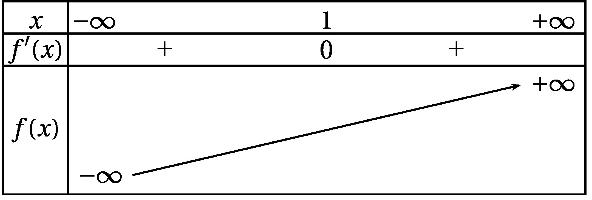
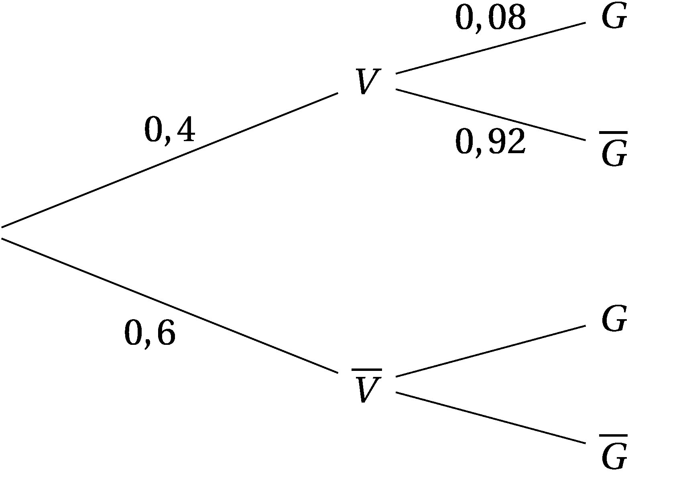
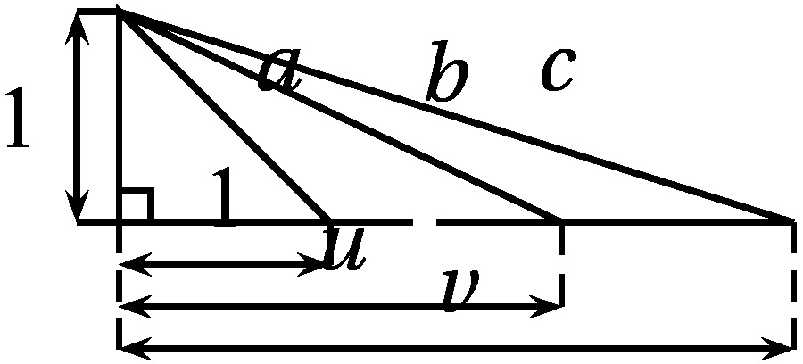
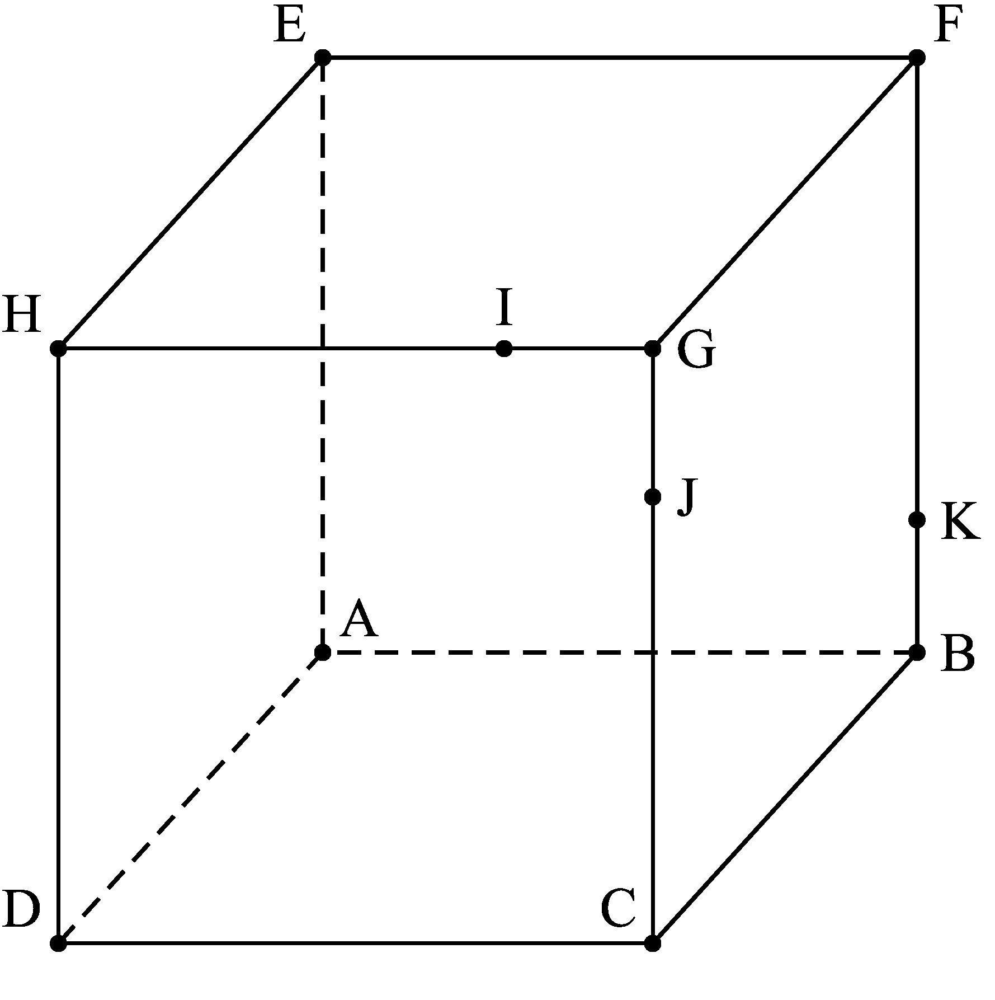
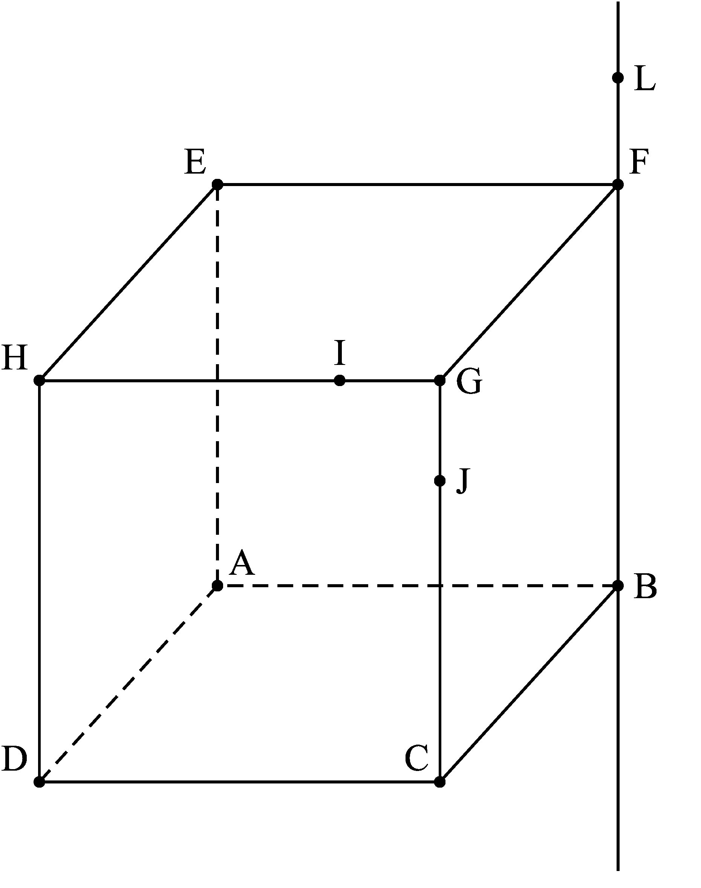

## Exercice 1: Commun à tous les candidats /5 points

*Pour chacune des cinq affirmations suivantes, indiquer si elle est vraie ou fausse, en justifiant la réponse.Une réponse non justifiée n'est pas prise en compte.*

**1.** On considère le nombre complexe $z = 1 + \text{i}\sqrt{3}$.

**Affirmation 1** : Le nombre complexe $z^2$ est un réel positif.

<ClientOnly><Solution points="/1">

$z^2 = \left(1 + \text{i}\sqrt{3} \right)^2 = 1 - 3 + 2\text{i}\sqrt{3} = - 2 + 2\text{i}\sqrt{3}$
qui n'est pas un réel.

</Solution>

**Affirmation 2** : L'argument du nombre complexe $z^{2019}$ vaut 0
modulo $2\pi$.

<ClientOnly><Solution>

On a $|z|^2 = 1 + 3 = 4 = 2^2$, d'où $|z| = 2$. On peut en factorisant 2
écrire :

$z = 2\left( \dfrac{1}{2} + \text{i}\dfrac{\sqrt{3}}{2}\right) = 2\left( \cos \dfrac{\pi}{3} + \text{î}\sin \dfrac{\pi}{3}\right) = 2 \text{e}^{\text{i}\frac{\pi}{3}}$.

Il suit que :
$z^{2019} = \left[ 2 \text{e}^{\text{i}\frac{\pi}{3}} \right]^{2019} = 2^{2019} \text{e}^{\text{i}\frac{2019\pi}{3}} = \text{e}^{673\text{i}\pi}$.

Or $673\pi = 672\pi + \pi$ donc un argument de $z^{2019}$ est $\pi$ à
$2\pi$ près.

L'affirmation est fausse.

</Solution>

Dans ce qui suit, le plan complexe est muni d'un repère orthonormé
direct $\left(\text{O};~\overrightarrow{u},~\overrightarrow{v}\right)$.

**1.** On considère les points A, B et C d'affixes respectives
$z_{\text{A}} = \sqrt{2} + 3\text{i},\: z_{\text{B}} = 1 + \text{i}$ et
$z_{\text{C}} = - 4\text{i}$.

**Affirmation 3** : Les points A, B et C ne sont pas alignés.

<ClientOnly><Solution>

Soit
$Z=\dfrac{z_A-z_C}{z_B-z_C}=\dfrac{\sqrt{2}+7\text{i}}{1+5\text{i}}=\dfrac{1}{16}\left(\sqrt{2}+7\text{i} \right)\left(1-5\text{i} \right)=\dfrac{1}{16}\left(\vphantom{\dfrac{numerateur}{denominateur}} (\sqrt{2}+35)+(7-5\sqrt{2})\text{i}\right)$

$Z \notin \R$ donc $arg(Z) \neq 0 (\pi)$    or   
$arg(Z)=arg\left(\dfrac{z_A-z_C}{z_B-z_C} \right)=\left(\overrightarrow{CB}~;~\overrightarrow{CA} \right) (2\pi)$

On en déduit que
$\left(\overrightarrow{CB}~;~\overrightarrow{CA} \right) \neq 0 (\pi)$
donc $A~,~B~\text{et}~C$ ne sont pas alignés.

L'affirmation est VRAIE.

</Solution>

**2.** On considère dans l'équation $2z^2 - 3z + 5 = 0$.

**Affirmation 4** : Cette équation admet deux solutions dont les images
sont symétriques par rapport à l'origine du repère.

<ClientOnly><Solution>

On a $\Delta = 9 - 4 \times 2 \times 5 = 9 - 40 = - 31$ : cette équation
a deux solutions complexes :

$z_1 - \dfrac{3 + \text{i}\sqrt{39}}{4}$
$z_1 - \dfrac{3 - \text{i}\sqrt{39}}{4}$ : les images de ces deux
complexes sont symétriques autour de l'axe des abscisses. L'affirmation
est fausse.

</Solution>

**3.** À tout point $M$ d'affixe $z$ du plan complexe, on associe le
point $M'$ d'affixe $z'$ définie par :

$$z' = \overline{z}(1- z).$$

**Affirmation 5** : Il existe une infinité de points $M$ confondus avec
leur point image $M'$.

<ClientOnly><Solution>

$M = M' \iff z' = z = \overline{z}(1- z)$.

Avec $z = x + \text{i}y$, d'où $\overline{z} = x  - \text{i}y$, on
obtient :

$z' = z \iff x + \text{i}y = ( x - \text{i}y)( 1 - x - \text{i}y) \iff x + \text{i}y = x(1 - x)  - y^2 + \text{i}[- xy + y(x - 1)]$.

En identifiant les parties réelles et imaginaires on obtient
respectivement :

$$
\left\{
\begin{array}{l c l}
x&=&x(1 - x) - y^2\\
y&=&- xy + y(x - 1)
\end{array}
\right.
$$

La première équation donne $x^2 + y^2 = 0$, équation qui n'est vérifiée
que par le couple (0 ; 0).

La deuxième équation donne $y = -xy  + xy - y$ soit : $2y = 0$ d'où
$y = 0$.

Les deux conditions devant être réalisées, le seul point confondu avec
son image est l'origine O. L'affirmation est fausse.

</Solution>

## Exercice 2: Commun à tous les candidats /5 points

**Partie A**

Soit $f$ la fonction définie sur $\R$ par

$$f(x) = x - \ln \left(x^2 + 1\right).$$

**1.** Résoudre dans $R$ l'équation : $f(x) =x$.

<ClientOnly><Solution>

Soit $x\in\R$ :

$$
\begin{array}{llcl}
&f(x)&=&x\\
\iff&x-\ln(x^2+1)&=&x\\
\iff&\ln(x^2+1)&=&0\\
\iff&x^2+1&=&e^0\\
\iff&x^2&=&0\\
\iff&x&=&0\\
\end{array}
$$

$$\text{L'équation }f(x)=x\text{ admet 0 pour unique solution}$$

</Solution>

**2.** Justifier tous les éléments du tableau de variations ci-dessous à
l'exception de la limite de la fonction $f$ en $+ \infty$ que l'on
admet.



<ClientOnly><Solution>

$\bullet\;$Montrons que $f$ est strictement croissante sur $\R$ :

La fonction $u : x\mapsto x^2+1$ est une fonction trinôme, donc
dérivable là où elle est définie, i.e $\R$.

Puisque $u>0$ sur $\R$, alors la fonction $\ln\circ u=\ln u$ est
dérivable sur $\R$.

Finalement, la fonction $f$ est dérivable sur $\R$ comme différence des
fonctions $x\mapsto x$ et $x\mapsto -\ln(x^2+1)$, toutes deux dérivables
sur $\R$. Pour tout nombre réel $x$, on a :

$$f'(x)=1-\dfrac{2x}{x^2+1}=\dfrac{x^2+1-2x}{x^2+1}=\dfrac{(x-1)^2}{x^2+1}$$

La fonction $f$ est dérivable sur $\R$ et sa fonction dérivée est
strictement positive sur $\R$, *sauf pour $x=1$* : on en déduit que $f$
est strictement croissante sur $\R$.

$\bullet\;$Montrons $\lim_{x\to -\infty}f(x)=-\infty$ :

De
$\left\{\begin{array}{l}\lim_{x\to -\infty}x^2+1=+\infty\\ \text{et}\\\lim_{X\to +\infty}\ln X=+\infty \end{array}
\right.$
on déduit, par composition : $\lim_{x\to -\infty}\ln(x^2+1)=+\infty$.

Il vient ensuite, par produit :
$$\lim_{x\to -\infty}-\ln(x^2+1)=-\infty$$

De
$\left\{\begin{array}{l}\lim_{x\to -\infty}x=-\infty\\ \text{et}\\\lim_{x\to -\infty}-\ln(x^2+1)=-\infty\end{array}
\right.$
on déduit, par somme :

$$\lim_{x\to -\infty}f(x)=-\infty$$

</Solution>

**3.** Montrer que, pour tout réel $x$ appartenant à \[0 ; 1\], $f(x)$
appartient à \[0 ; 1\].

<ClientOnly><Solution>

La fonction $f$ est (strictement) croissante sur $[0,1]$. Par suite :

$$\forall x\in [0,1]\qquad f(0)\leqslant f(x)\leqslant f(1)$$

On a
$\left\{\begin{array}{l}f(0)=0-\ln(0^2+1)=0\\ \text{et}\\ f(1)=1-\ln(1^2+1)=1-\ln 2\end{array}
\right.$.
Puisque $1-\ln 2<1$, alors

$$
\forall x\in [0,1]\qquad 0\leqslant f(x)<1
$$

On a prouvé :

$$\forall x\in[0,1]\qquad f(x)\in[0,1]$$

</Solution>

**4.** On considère l'algorithme suivant :

```
  Variables    N et A des entiers naturels ;
  Entrée       Saisir la valeur de A
  Traitement   N prend la valeur 0
               Tant que N - ln(N^2 + 1) < A
               $ prend la valeur N + 1
               Fin tant que
  Sortie       Afficher N
```

**4.a)** Que fait cet algorithme ?

<ClientOnly><Solution>

L'algorithme affiche la plus petite valeur de $N$ pour laquelle
$N-\ln(N^2+1)$ est supérieur ou égal à $N$.

</Solution>

**4.b)** Déterminer la valeur $N$ fournie par l'algorithme lorsque la
valeur saisie pour $A$ est 100.

<ClientOnly><Solution>

Pour $A=100$, l'algorithme affiche $110$

</Solution>

**Partie B**

Soit $\left(u_n\right)$ la suite définie par $u_0 = 1$ et, pour tout
entier naturel $n$, $u_{n+1} = u_n -\ln \left(u_n^2 + 1\right)$.

**1.** Montrer par récurrence que, pour tout entier naturel $n$, $u_n$
appartient à \[0 ; 1\].

<ClientOnly><Solution>

Pour tout entier naturel $n$, notons $\mathcal{P}_n$ la propriété :
$u_n\in[0,1]$.

$\bullet\;$ Puisque $u_0=1$, $\mathcal{P}_0$ est vraie.

$\bullet\;$ Supposons vraie la propriété $\mathcal{P}_n$ pour *un* entier
naturel $n$ quelconque.

On a alors : $u_n \in [0~;~1]$.

D'après la troisième question de la partie A, on en déduit :

$$
f(u_n)\in[0~;~1]
$$
soit :

$$
u_{n+1}\in[0~;~1]
$$
On a prouvé :

$$
\forall n\in\N\quad \mathcal{P}_n\text{ est vraie}\Longrightarrow\mathcal{P}_{n+1}\text{ est vraie}
$$

$\bullet\;$On a prouvé par récurrence :

$$
\forall n\in\N\qquad u_n\in[0~;~1]
$$

</Solution>

**2.** Étudier les variations de la suite $\left(u_n\right)$.

<ClientOnly><Solution>

Soit $n\in\N$ :

$u_{n+1}-u_n=-\ln(u_n^2+1)$.

Étudions le signe de $-\ln(u_n^2+1)$ :

Puisque $0\leqslant u_n\leqslant 1$, on en déduit, la fonction carré
étant croissante sur $[0,1]$ :

$$
0^2\leqslant u_n ^2\leqslant 1^2
$$

soit :

$$
u_n^2\in[0~;~1]
$$

Par suite :

$$
u_n^2+1\in[1~;~2]
$$
La fonction $\ln$ est croissante sur $[1~;~+\infty[$ :

De $u_n^2+1\geqslant 1$, on déduit
$\ln \left(u_n^2+1\right)\geqslant \ln 1$, soit
$\ln \left(u_n^2+1\right)\geqslant 0$.

Puisque $u_{n+1} -  u_n = -\ln(u_n^2+1)\leqslant 0$, alors

$$\text{La suite $u$ est décroissante }$$

</Solution>

**3.** Montrer que la suite $\left(u_n\right)$ est convergente.

<ClientOnly><Solution>

La suite $u$ est décroissante et minorée par $0$ : elle converge donc,
en vertu du théorème de la limite monotone, vers un nombre réel $\ell$.

</Solution>

**4.** On note $\ell$ sa limite, et on admet que $\ell$ vérifie
l'égalité $f(\ell) = \ell$.

En déduire la valeur de $\ell$.

<ClientOnly><Solution>

Puisque l'équation $f(x) = x$ admet $0$ pour unique solution, on en
déduit :

$$\ell = 0$$

</Solution>

## Exercice 3: Commun à tous les candidats /5 points

On considère le cube ABCDEFGH représenté ci-dessous.

On définit les points I et J respectivement par
$\overrightarrow{\text{HI}} = \dfrac{3}{4} \overrightarrow{\text{HG}}$
et
$\overrightarrow{\text{JG}} = \dfrac{1}{4} \overrightarrow{\text{CG}}$.


**1.** **Sur le document réponse donné en annexe, à rendre avec la
copie**, tracer, sans justifier, la section du cube par le plan (IJK) où
K est un point du segment \[BF\].

<ClientOnly><Solution>

On trace la section du cube par le plan (IJK):


</Solution>

**2.** **Sur le document réponse donné en annexe, à rendre avec la
copie**, tracer, sans justifier, la section du cube par le plan (IJL) où
L est un point de la droite (BF).

<ClientOnly><Solution>

On trace la section du cube par le plan (IJL):


</Solution>

**3.** On se place dans le repère
$\left(A;\overrightarrow{AB},\overrightarrow{AD},\overrightarrow{AE}\right)$.

**3.a)** Donner, sans justifer, les coordonnées du point $J$.

<ClientOnly><Solution>

$J \left(1,1,\frac{3}{4}\right)$

</Solution>

**3.b)** On admet que $I\left(\frac{3}{4};1;1\right)$ et
$K\left(1;0;\frac{1}{3}\right)$. Déterminer une représentation
paramétrique de la droite $(IK)$.

<ClientOnly><Solution>

$M(x,xy,z) \in (IK) \iff \exists t \in \R : \overrightarrow{KM}=t\overrightarrow{IK}$

$\iff \left\{
\begin{array}{l c r}
x-1 &=& t(1-\frac{3}{4}) \\
y-0 &= & t(0-1) \\
z-\frac{1}{3} &=&t (\frac{1}{3}-1
\end{array}
\right.$ où $t \in \R$ $\iff \left\{
\begin{array}{l c r}
x &=& \frac{1}{4}t + 1\\
y &= &-  t \\
z &=&-\frac{2}{3}t - \frac{1}{3}
\end{array}
\right.$ où $t \in \R$

</Solution>

**3.c)** On donne la droite $d$ de représentation paramétrique $\left\{
\begin{array}{l c r}
x &=& 2t + 1\\
y &= &- 2 t + 9\\
z &=&t - 3
\end{array}
\right.$ où $t \in \R$. Le point $L(5~;~5~;~-1)$ appartient-il à $d$ ?
Justifier.

<ClientOnly><Solution>

On cherche s'il existe un réel t pour que les coordonnées du point $L$
vérifient le système: $\left\{
\begin{array}{l c r}
5 &=& 2t + 1\\
5 &= &- 2 t + 9\\
-1 &=&t - 3
\end{array}
\right.$ soit $\left\{
\begin{array}{l c r}
4 &=& 2t \\
-4 &= &- 2 t \\
2 &=&t
\end{array}
\right.$ d'où $t=2$ et oui le point appartient à la droite

</Solution>

**3.d)** On donne la droite $\Delta$ de représentation paramétrique
$\left\{
\begin{array}{l c r}
x &=& -1-3t\\
y &= &7+t\\
z &=&-3-2t
\end{array}
\right.$ où $t \in \R$. Les droites $d$ et $\Delta$ sont-elles sécantes
? Si oui en quel point ?

<ClientOnly><Solution>

On cherche s'il existent deux réels $t$ et $t'$ tels que :\
$\left\{
\begin{array}{l c r}
2t'+1 &=& -1-3t\\
-2t'+9 &= &7+t\\
t'-3 &=&-3-2t
\end{array}
\right. \iff \left\{
\begin{array}{l c r}
2t'+3t &=& -2\\
-2t'+2 &= &t\\
t' &=&-2t
\end{array}
\right.\iff \left\{
\begin{array}{l c r}
-4t+3t &=& -2\\
-2(2t)+2 &= &t\\
t' &=&-2t
\end{array}
\right.\iff \left\{
\begin{array}{l c r}
t &=& 2\\
t &= &\frac{2}{5}\\
t' &=&-4
\end{array}
\right.$ le système n'admet pas de solution les deux droites ne sont pas
sécantes.

</Solution>

## Exercice 4: Pour les candidats n'ayant pas suivi l'enseignement de spécialité /5 points

*Les parties A et B de cet exercice sont indépendantes.*

Le virus de la grippe atteint chaque année, en période hivernale, une
partie de la population d'une ville.

La vaccination contre la grippe est possible; elle doit être renouvelée
chaque année.

**Partie A**

L'efficacité du vaccin contre la grippe peut être diminuée en fonction
des caractéristiques individuelles des personnes vaccinées, ou en raison
du vaccin, qui n'est pas toujours totalement adapté aux souches du virus
qui circulent. Il est donc possible de contracter la grippe tout en
étant vacciné.

Une étude menée dans la population de la ville à l'issue de la période
hivernale a permis de constater que :

-   40 % de la population est vaccinée ;

-   8 % des personnes vaccinées ont contracté la grippe ;

-   20 % de la population a contracté la grippe.

On choisit une personne au hasard dans la population de la ville et on
considère les évènements :

 

:   $V$ : \<\< la personne est vaccinée contre la grippe \>\> ;

 

:   $G$ : \<\< la personne a contracté la grippe \>\>.

**1.**

**1.a)** Donner la probabilité de l'évènement $G$.

<ClientOnly><Solution>

$P(G)=0,2$ car 20% de la population a contracté la grippe.

</Solution>

**1.b)** Reproduire l'arbre pondéré ci-dessous et compléter les
pointillés indiqués sur quatre de ses branches.

<ClientOnly><Solution>

On obtient :



</Solution>

**2.** Déterminer la probabilité que la personne choisie ait contracté
la grippe et soit vaccinée.

<ClientOnly><Solution>

On calcule $P(G \cap V) = 0,4 \times 0,08 = 0,032$ soit $3,2\%$ de
chances que la personne ait contractée la grippe et soit vaccinée.

</Solution>

**3.** La personne choisie n'est pas vaccinée. Montrer que la
probabilité qu'elle ait contracté la grippe est égale à $0,28$.

<ClientOnly><Solution>

On calcule
$P_{\overline{V}} (G) =\dfrac{P\left(\overline{V} \cap G\right) }{P\left(\overline{V}\right)}$

D'après la formule des probabilités totales,
$P(V \cap G) + P\left(\overline{V} \cap G\right) = P\left(G\right)$.

Donc
$P\left(\overline{V} \cap G\right) = P(G) - P(V \cap G) = 0,2 - 0,032 = 0,168$
puis $P_{\overline{V}} (G) = \dfrac{0,168}{0,6} =0,28$.

La probabilité qu'une personne non vaccinée ait contracté la grippe est
égale à 0,28.

</Solution>

**Partie B**

*Dans cette partie, les probabilités demandées seront données à
$10^{-3}$ près.*

Un laboratoire pharmaceutique mène une étude sur la vaccination contre
la grippe dans cette ville.

Après la période hivernale, on interroge au hasard $n$ habitants de la
ville, en admettant que ce choix se ramène à $n$ tirages successifs
indépendants et avec remise. On suppose que la probabilité qu'une
personne choisie au hasard dans la ville soit vaccinée contre la grippe
est égale à $0,4$.

On note $X$ la variable aléatoire égale au nombre de personnes vaccinées
parmi les $n$ interrogées.

**1.** Quelle est la loi de probabilité suivie par la variable aléatoire
$X$ ?

<ClientOnly><Solution>

Il s'agit de $n$ expériences aléatoires identiques et indépendantes à 2
issues (la personne est vaccinée ou non) avec une probabilité de succès
de $0,4$.

La variable aléatoire $X$ compte le nombre de succès donc $X$ suit la
loi binomiale $\mathcal{B}(n~;~0,4)$.

</Solution>

**2.** Dans cette question, on suppose que $n = 40$.

**2.a)** Déterminer la probabilité qu'exactement $15$ des $40$ personnes
interrogées soient vaccinées.

<ClientOnly><Solution>

$P(X=15) \approx 0,123$

</Solution>

**2.b)** Déterminer la probabilité qu'au moins la moitié des personnes
interrogées soit vaccinée.

<ClientOnly><Solution>

$P(X \geqslant 20) = 1- P(X < 20) =  1- P(X \leqslant 19) \approx 0,130$

</Solution>

**3.** On s'intéresse à l'impact économique de la grippe sur la
population active (personnes ayant un emploi).

D'après le réseau des GROG (Groupes Régionaux d'Observation de la
Grippe), le coût direct moyen d'un cas de grippe est de 70 euros
(médecin + actes de soins + médicaments), auquel il faut ajouter les
indemnités journalières d'absences ( environ 4,8 jours d'absences en
moyenne par personne ) soit 50 euros.

Par conséquent on peut estimer qu'un patient atteint de la grippe
\"coûte\" 120 euros en frais de santé.

D'un autre coté, une vaccination contre la grippe coûte le prix du
vaccin (7 euros), plus la consultation chez le médecin (23 euros), soit
30 euros au total.

**3.a)** Quel est le coût en frais de santé d'une personne active qui
s'est fait vacciner et qui contracte la grippe ?

<ClientOnly><Solution>

$120+30=150$

</Solution>

**3.b)** On note $Z$ la variable aléatoire qui, à chaque personne
active, associe le cout total de la grippe. Donner sous forme de tableau
la loi de probabilité de $Z$.

<ClientOnly><Solution>

-   $P(Z=0) = P(\overline{V} \cap \overline{G})= 0,432$

-   $P(Z=30)= P(V \cap \overline{G})=0,368$

-   $P(Z=120)= P(\overline{V} \cap G)=0,168$

-   $P(Z=150)= P(V \cap G)=0,032$

D'où la loi de probabilité de $Z$:

   $z_i$     0      30      120     150
  ------- ------- ------- ------- -------
   $p_i$   0,432   0.368   0.168   0.032

</Solution>

**3.c)** Quel est le coût moyen par personne active ?

<ClientOnly><Solution>

$E(Z) = 0.432 \times 0+0.368 \times 30+0.168 \times 120+0.032 \times 150=36$

</Solution>

**3.d)** En 2017, la France comptait environ 26,9 millions d'actifs[^1]
. Quel a été le coût total de la grippe en 2017 sur la population active
?

<ClientOnly><Solution>

$26,9 \times 10^6 \times 36=968 \times 10^6$

Le coût a été de 968 millions d'euros, soit presque 1 milliards d'euros
!

</Solution>

## Exercice 4: Pour les candidats ayant suivi l'enseignement de spécialité /5 points

On s'intéresse à la figure suivante, dans laquelle $a$, $b$ et $c$
désignent les longueurs des hypoténuses des trois triangles rectangles
en O dessinés ci-dessous.



**Problème :** on cherche les couples de **nombres entiers naturels non
nuls** $(u,~v)$ tels que $ab = c$.

**1.** Modélisation

Démontrer que les solutions du problème sont des solutions de l'équation
:

$$(E) :\quad  v^2 - 2u^2 = 1\quad  (v \text{ et }\: u \: \text{ étant des entiers naturels non nuls}).$$

<ClientOnly><Solution>

Dans le triangle rectangle, on applique le théorème de Pythagore :
$a^2=1^2+1^2=2$.

En appliquant le théorème dans les deux autres triangles rectangles on
peut écrire :

$b^2=1^2+u^2=1+u^2$ et $c^2=1^2+v^2=1+v^2$.

$a$, $b$ et $c$ sont 3 longueurs donc sont des nombres positifs donc
$ab=c \iff a^2b^2=c^2$; ainsi $2(1+u^2)=1+v^2$ c'est-à-dire
$2+2u^2=1+v^2$ donc $v^2-2u^2=1$.

Les solutions du problème sont donc les solutions $(u~;~v)$ de
l'équation $(E): \, v^2 - 2u^2=1$ où $u$ et $v$ sont des entiers
naturels non nuls.

</Solution>

**2.** Recherche systématique de solutions de l'équation $(E)$

Recopier et compléter l'algorithme suivant pour qu'il affiche au cours
de son exécution tous les couples solutions de l'équation pour lesquels
$1 \leqslant u \leqslant 1000$ et $1 \leqslant v \leqslant 1000$.

```
Pour u allant de 1 à ...faire
Pour ... 
Si ... 
Afficher u et v
Fin Si
Fin Pour
Fin Pour
```

<ClientOnly><Solution>

Algorithme :

```
  ----------------------------------- ----------------------------
  Pour u allant de 1 à 1000 faire   Au cours de son exécution,
  Pour v allant de 1 à 1000         l'algorithme affiche :
  Si v^2-2u^2=1                     2
  Afficher u et v                   12
  Fin Si                            70
  Fin Pour                          408
  Fin Pour                            
  ----------------------------------- ----------------------------
```

</Solution>

**3.** Analyse des solutions éventuelles de l'équation $(E)$

On suppose que le couple $(u,~v)$ est une solution de l'équation $(E)$.

**3.a)** Établir que $u < v$.

<ClientOnly><Solution>

Supposons que le couple $(u,v)$ est une solution de l'équation $(E)$ et
que $u\geqslant v$.

On a alors : $u^2 \geqslant v^2$ et comme $2u^2 \geqslant u^2$, on a
$2u^2 \geqslant v^2$ ce qui implique $v^2-2u^2\leqslant 0$.

C'est impossible car $v^2-2u^2=1$.

Conclusion : $u < v$.

</Solution>

**3.b)** Démontrer que $n$ et $n^2$ ont la même parité pour tout entier
naturel $n$.

<ClientOnly><Solution>

On suppose que $n$ est pair. Il existe alors un entier naturel $k$ tel
que $n=2k$.

On a alors $n^2=(2k)^2=4k^2=2(2k^2)$. Ainsi $n^2$ est pair.

On suppose que $n$ est impair. Il existe alors une entier naturel $q$
tel que $n=2q+1$.

Alors $n^2=(q+1)2=4q^2+4q+1=2(2q^2+2q)+1$. Ainsi $n^2$ est impair.

Conclusion : $n$ et $n^2$ ont la même parité.

</Solution>

**3.c)** Démontrer que $v$ est un nombre impair.

<ClientOnly><Solution>

Soit un couple solution $(u,v)$ du problème. On a :

$v^2-2u^2=1 \iff v^2=2u^2+1$.

Ainsi $v^2$ est impair. D'après la question précédente $v$ est aussi
impair.

</Solution>

**3.d)** Établir que $2u^2 =(v-1)(v+1)$.

En déduire que $u$ est un nombre pair.

<ClientOnly><Solution>

On a : $v^2-2u^2=1 \iff 2u^2=v^2-1 \iff 2u^2=(v-1)(v+1)$.

Or $v$ est impair donc $v-1$ et $v+1$ sont pairs : il existe ainsi un
entier naturel $k$ tel que $v-1=2k$ et $v+1=2(k+1)$.

Alors $2u^2=2k \times 2(k+1) \iff u^2=2k(k+1)$.

$u^2$ est donc pair. D'après la question **3.b.**, $u$ est donc pair.

</Solution>

**4.** Une famille de solutions

On assimile un couple de nombres entiers $(u,~v)$ à la matrice colonne
$X = 
\begin{pmatrix}u\\v\end{pmatrix}
$.

On définit également la matrice $A = 
\begin{pmatrix}3&2\\4&3\end{pmatrix}
$.

**4.a)** Démontrer que si une matrice colonne $X$ est une solution de
l'équation $(E)$, alors $AX$ est aussi une solution de l'équation $(E)$.

<ClientOnly><Solution>

Soit $X=
\begin{pmatrix}     u\\v        \end{pmatrix}
$ une solution de
l'équation $(E)$.

$$
AX=
\begin{pmatrix} 3&2\\ 4&3 \end{pmatrix}
\times 
\begin{pmatrix} u\\ v
\end{pmatrix}
=
\begin{pmatrix} 3u+2v\\ 4u+3v\end{pmatrix}
$$


On a :
$(4u+3v)^2-2(3u+2v)^2=16u^2+24uv+9v^2-18u^2-24uv-8v^2=v^2-2u^2=1$.

Ainsi $AX$ est aussi solution de $(E)$.

</Solution>

**4.b)** Démontrer que si une matrice colonne $X$ est une solution de
l'équation $(E)$, alors pour tout entier naturel $n$, $A^n X$ est aussi
une solution de l'équation $(E)$.

<ClientOnly><Solution>

Montrons par récurrence que pour tout entier naturel $n$, $A^nX$ est une
solution de l'équation $(E)$.

-   Initialisation : $n=0$.

    $A^0X=I_2X=X$. Et $X$ est solution de $(E)$. L'affirmation est donc
    vraie pour $n=0$.

-   Soit $n \geqslant 0$ quelconque tel que $A^nX$ est une solution de
    $(E)$.

    $A^{n+1}X=A \times A^nX$ est une solution de $(E)$ d'après la
    question précédente.

-   Conclusion : la propriété est vraie pour $n=0$ et est héréditaire
    pour tout $n\geqslant 0$. D'après le raisonnement par récurrence, la
    propriété est vraie pour tout $n\geqslant 0$.

On a donc démontré que, si $X$ est une solution de $(E)$, alors, pour
tout entier naturel $n$, $A^nX$ est aussi une solution de $(E)$.

</Solution>

**4.c)** À l'aide de la calculatrice, donner un couple $(u,~v)$ solution
de l'équation $(E)$ tel que

$v > 10000$.

<ClientOnly><Solution>

On a : $3^2-2 \times 2^2=9-8=1$ donc le couple $(2;3)$ est solution de
$(E)$.

$A^5 \times X = 
\begin{pmatrix} 13860\\ 19601\end{pmatrix}
$.

Donc le couple $(13860~;~19601)$ est une solution de $(E)$ telle que
$v > 10000$.

</Solution>

## ANNEXE de l'exercice 3

**Exercice 3, question 1**



**Exercice 3, question 2**


