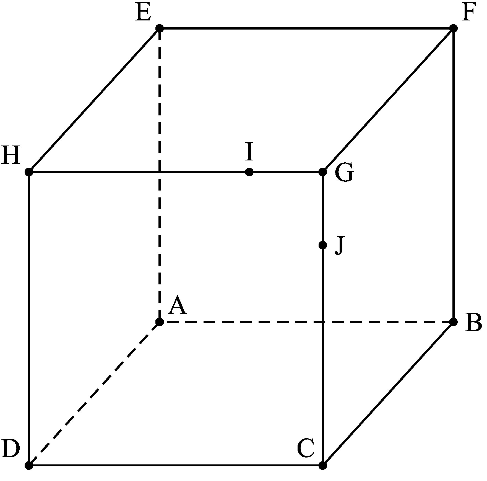
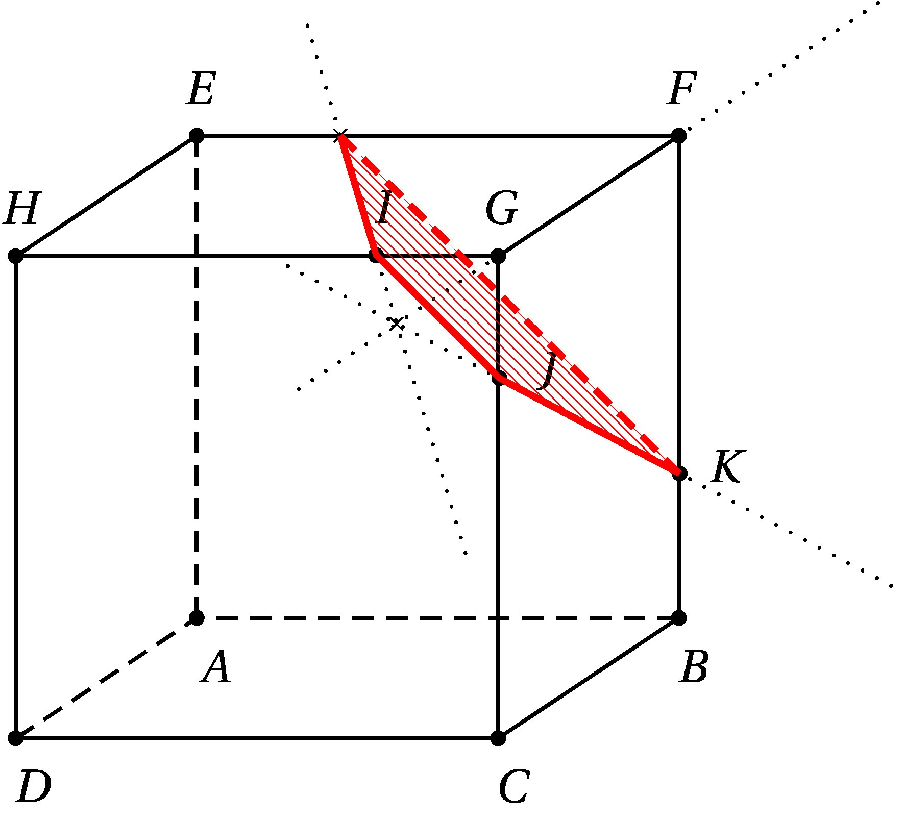
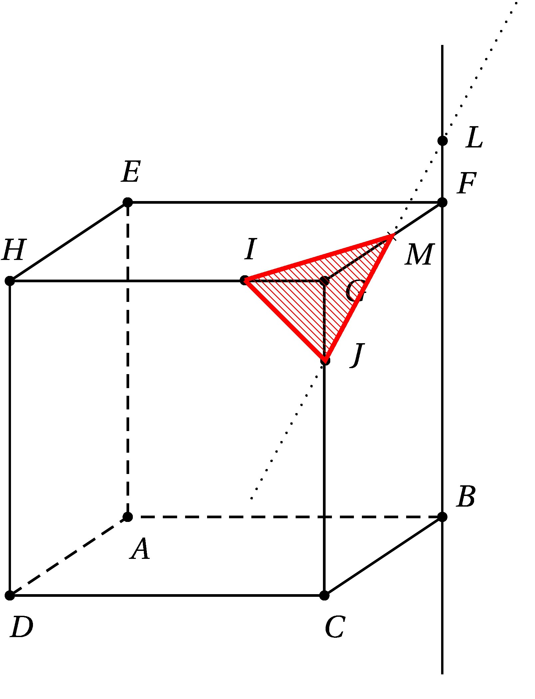

## Exercice 1: Commun à tous les candidats /5 points

*Pour chacune des cinq affirmations suivantes, indiquer si elle est vraie ou fausse, en justifiant la réponse.Une réponse non justifiée n'est pas prise en compte.*

**1.** On considère le nombre complexe $z = 1 + \text{i}\sqrt{3}$.

**Affirmation 1** : Le nombre complexe $z^2$ est un réel positif.

<ClientOnly><Solution>

$z^2 = \left(1 + \text{i}\sqrt{3} \right)^2 = 1 - 3 + 2\text{i}\sqrt{3} = - 2 + 2\text{i}\sqrt{3}$
qui n'est pas un réel.

</Solution>

**Affirmation 2** : L'argument du nombre complexe $z^{2019}$ vaut 0
modulo $2\pi$.

<ClientOnly><Solution>

On a $|z|^2 = 1 + 3 = 4 = 2^2$, d'où $|z| = 2$. On peut en factorisant 2
écrire :

$z = 2\left( \dfrac{1}{2} + \text{i}\dfrac{\sqrt{3}}{2}\right) = 2\left( \cos \dfrac{\pi}{3} + \text{î}\sin \dfrac{\pi}{3}\right) = 2 \text{e}^{\text{i}\frac{\pi}{3}}$.

Il suit que :
$z^{2019} = \left[ 2 \text{e}^{\text{i}\frac{\pi}{3}} \right]^{2019} = 2^{2019} \text{e}^{\text{i}\frac{2019\pi}{3}} = \text{e}^{673\text{i}\pi}$.

Or $673\pi = 672\pi + \pi$ donc un argument de $z^{2019}$ est $\pi$ à
$2\pi$ près.

L'affirmation est fausse.

</Solution>

Dans ce qui suit, le plan complexe est muni d'un repère orthonormé
direct $\left(\text{O};~\overrightarrow{u},~\overrightarrow{v}\right)$.

**1.** On considère les points A, B et C d'affixes respectives
$z_{\text{A}} = \sqrt{2} + 3\text{i},\: z_{\text{B}} = 1 + \text{i}$ et
$z_{\text{C}} = - 4\text{i}$.

**Affirmation 3** : Les points A, B et C ne sont pas alignés.

<ClientOnly><Solution>

Soit
$Z=\dfrac{z_A-z_C}{z_B-z_C}=\dfrac{\sqrt{2}+7\text{i}}{1+5\text{i}}=\dfrac{1}{16}\left(\sqrt{2}+7\text{i} \right)\left(1-5\text{i} \right)=\dfrac{1}{16}\left(\vphantom{\dfrac{numerateur}{denominateur}} (\sqrt{2}+35)+(7-5\sqrt{2})\text{i}\right)$

$Z \notin \R$ donc $arg(Z) \neq 0 (\pi)$    or   
$arg(Z)=arg\left(\dfrac{z_A-z_C}{z_B-z_C} \right)=\left(\overrightarrow{CB}~;~\overrightarrow{CA} \right) (2\pi)$

On en déduit que
$\left(\overrightarrow{CB}~;~\overrightarrow{CA} \right) \neq 0 (\pi)$
donc $A~,~B~\text{et}~C$ ne sont pas alignés.

L'affirmation est VRAIE.

</Solution>

**2.** On considère dans l'équation $2z^2 - 3z + 5 = 0$.

**Affirmation 4** : Cette équation admet deux solutions dont les images
sont symétriques par rapport à l'origine du repère.

<ClientOnly><Solution>

On a $\Delta = 9 - 4 \times 2 \times 5 = 9 - 40 = - 31$ : cette équation
a deux solutions complexes :

$z_1 - \dfrac{3 + \text{i}\sqrt{39}}{4}$
$z_1 - \dfrac{3 - \text{i}\sqrt{39}}{4}$ : les images de ces deux
complexes sont symétriques autour de l'axe des abscisses. L'affirmation
est fausse.

</Solution>

**3.** À tout point $M$ d'affixe $z$ du plan complexe, on associe le
point $M'$ d'affixe $z'$ définie par :

$$z' = \overline{z}(1- z).$$

**Affirmation 5** : Il existe une infinité de points $M$ confondus avec
leur point image $M'$.

<ClientOnly><Solution>

$M = M' \iff z' = z = \overline{z}(1- z)$.

Avec $z = x + \text{i}y$, d'où $\overline{z} = x  - \text{i}y$, on
obtient :

$z' = z \iff x + \text{i}y = ( x - \text{i}y)( 1 - x - \text{i}y) \iff x + \text{i}y = x(1 - x)  - y^2 + \text{i}[- xy + y(x - 1)]$.

En identifiant les parties réelles et imaginaires on obtient
respectivement :

$$
\left\{
\begin{array}{l c l}
x&=&x(1 - x) - y^2\\
y&=&- xy + y(x - 1)
\end{array}
\right.
$$

La première équation donne $x^2 + y^2 = 0$, équation qui n'est vérifiée
que par le couple (0 ; 0).

La deuxième équation donne $y = -xy  + xy - y$ soit : $2y = 0$ d'où
$y = 0$.

Les deux conditions devant être réalisées, le seul point confondu avec
son image est l'origine O. L'affirmation est fausse.

</Solution>

## Exercice 2: Commun à tous les candidats /5 points

**Partie A**

Soit $f$ la fonction définie sur $\R$ par

$$f(x) = x - \ln \left(x^2 + 1\right).$$

**1.** Résoudre dans $R$ l'équation : $f(x) =x$.

<ClientOnly><Solution>

Soit $x\in\R$ :

$$
\begin{array}{llcl}
&f(x)&=&x\\
\iff&x-\ln(x^2+1)&=&x\\
\iff&\ln(x^2+1)&=&0\\
\iff&x^2+1&=&e^0\\
\iff&x^2&=&0\\
\iff&x&=&0\\
\end{array}
$$

$$\text{L'équation }f(x)=x\text{ admet 0 pour unique solution}$$

</Solution>

**2.** Justifier tous les éléments du tableau de variations ci-dessous à
l'exception de la limite de la fonction $f$ en $+ \infty$ que l'on
admet.

<ClientOnly><Solution>

$\bullet\;$Montrons que $f$ est strictement croissante sur $\R$ :

La fonction $u : x\mapsto x^2+1$ est une fonction trinôme, donc
dérivable là où elle est définie, i.e $\R$.

Puisque $u>0$ sur $\R$, alors la fonction $\ln\circ u=\ln u$ est
dérivable sur $\R$.

Finalement, la fonction $f$ est dérivable sur $\R$ comme différence des
fonctions $x\mapsto x$ et $x\mapsto -\ln(x^2+1)$, toutes deux dérivables
sur $\R$. Pour tout nombre réel $x$, on a :

$$f'(x)=1-\dfrac{2x}{x^2+1}=\dfrac{x^2+1-2x}{x^2+1}=\dfrac{(x-1)^2}{x^2+1}$$

La fonction $f$ est dérivable sur $\R$ et sa fonction dérivée est
strictement positive sur $\R$, *sauf pour $x=1$* : on en déduit que $f$
est strictement croissante sur $\R$.

$\bullet\;$Montrons $\lim_{x\to -\infty}f(x)=-\infty$ :

De
$\left\{\begin{array}{l}\lim_{x\to -\infty}x^2+1=+\infty\\ \text{et}\\\lim_{X\to +\infty}\ln X=+\infty \end{array}
\right.$
on déduit, par composition : $\lim_{x\to -\infty}\ln(x^2+1)=+\infty$.

Il vient ensuite, par produit :
$$\lim_{x\to -\infty}-\ln(x^2+1)=-\infty$$

De
$\left\{\begin{array}{l}\lim_{x\to -\infty}x=-\infty\\ \text{et}\\\lim_{x\to -\infty}-\ln(x^2+1)=-\infty\end{array}
\right.$
on déduit, par somme :

$$\lim_{x\to -\infty}f(x)=-\infty$$

</Solution>

**3.** Montrer que, pour tout réel $x$ appartenant à \[0 ; 1\], $f(x)$
appartient à \[0 ; 1\].

<ClientOnly><Solution>

La fonction $f$ est (strictement) croissante sur $[0,1]$. Par suite :

$$\forall x\in [0,1]\qquad f(0)\leqslant f(x)\leqslant f(1)$$

On a
$\left\{\begin{array}{l}f(0)=0-\ln(0^2+1)=0\\ \text{et}\\ f(1)=1-\ln(1^2+1)=1-\ln 2\end{array}
\right.$.
Puisque $1-\ln 2<1$, alors

$$
\forall x\in [0,1]\qquad 0\leqslant f(x)<1
$$

On a prouvé :

$$\forall x\in[0,1]\qquad f(x)\in[0,1]$$

</Solution>

**4.** On considère l'algorithme suivant :

  Variables    $N$ et $A$ des entiers naturels ;
  ------------ --------------------------------------------
  Entrée       Saisir la valeur de $A$
  Traitement   $N$ prend la valeur $0$
               Tant que $N - \ln\left(N^2 + 1\right) < A$
               $N$ prend la valeur $N + 1$
               Fin tant que
  Sortie       Afficher $N$

**4.a)** Que fait cet algorithme ?

<ClientOnly><Solution>

L'algorithme affiche la plus petite valeur de $N$ pour laquelle
$N-\ln(N^2+1)$ est supérieur ou égal à $N$.

</Solution>

**4.b)** Déterminer la valeur $N$ fournie par l'algorithme lorsque la
valeur saisie pour $A$ est 100.

<ClientOnly><Solution>

Pour $A=100$, l'algorithme affiche $110$

</Solution>

**Partie B**

Soit $\left(u_n\right)$ la suite définie par $u_0 = 1$ et, pour tout
entier naturel $n$, $u_{n+1} = u_n -\ln \left(u_n^2 + 1\right)$.

**1.** Montrer par récurrence que, pour tout entier naturel $n$, $u_n$
appartient à \[0 ; 1\].

<ClientOnly><Solution>

Pour tout entier naturel $n$, notons $\mathcal{P}_n$ la propriété :
$u_n\in[0,1]$.

$\bullet\;$ Puisque $u_0=1$, $\mathcal{P}_0$ est vraie.

$\bullet\;$ Supposons vraie la propriété $\mathcal{P}_n$ pour *un* entier
naturel $n$ quelconque.

On a alors : $u_n \in [0~;~1]$.

D'après la troisième question de la partie A, on en déduit :

$$
f(u_n)\in[0~;~1]
$$
soit :

$$
u_{n+1}\in[0~;~1]
$$
On a prouvé :

$$
\forall n\in\N\quad \mathcal{P}_n\text{ est vraie}\Longrightarrow\mathcal{P}_{n+1}\text{ est vraie}
$$

$\bullet\;$On a prouvé par récurrence :

$$
\forall n\in\N\qquad u_n\in[0~;~1]
$$

</Solution>

**2.** Étudier les variations de la suite $\left(u_n\right)$.

<ClientOnly><Solution>

Soit $n\in\N$ :

$u_{n+1}-u_n=-\ln(u_n^2+1)$.

Étudions le signe de $-\ln(u_n^2+1)$ :

Puisque $0\leqslant u_n\leqslant 1$, on en déduit, la fonction carré
étant croissante sur $[0,1]$ :

$$
0^2\leqslant u_n ^2\leqslant 1^2
$$

soit :

$$
u_n^2\in[0~;~1]
$$

Par suite :

$$
u_n^2+1\in[1~;~2]
$$
La fonction $\ln$ est croissante sur $[1~;~+\infty[$ :

De $u_n^2+1\geqslant 1$, on déduit
$\ln \left(u_n^2+1\right)\geqslant \ln 1$, soit
$\ln \left(u_n^2+1\right)\geqslant 0$.

Puisque $u_{n+1} -  u_n = -\ln(u_n^2+1)\leqslant 0$, alors

$$\text{La suite $u$ est décroissante }$$

</Solution>

**3.** Montrer que la suite $\left(u_n\right)$ est convergente.

<ClientOnly><Solution>

La suite $u$ est décroissante et minorée par $0$ : elle converge donc,
en vertu du théorème de la limite monotone, vers un nombre réel $\ell$.

</Solution>

**4.** On note $\ell$ sa limite, et on admet que $\ell$ vérifie
l'égalité $f(\ell) = \ell$.

En déduire la valeur de $\ell$.

<ClientOnly><Solution>

Puisque l'équation $f(x) = x$ admet $0$ pour unique solution, on en
déduit :

$$\ell = 0$$

</Solution>

## Exercice 3: Commun à tous les candidats /5 points

On considère le cube ABCDEFGH représenté ci-dessous.

On définit les points I et J respectivement par
$\overrightarrow{\text{HI}} = \dfrac{3}{4} \overrightarrow{\text{HG}}$
et
$\overrightarrow{\text{JG}} = \dfrac{1}{4} \overrightarrow{\text{CG}}$.

**1.** **Sur le document réponse donné en annexe, à rendre avec la
copie**, tracer, sans justifier, la section du cube par le plan (IJK) où
K est un point du segment \[BF\].

<ClientOnly><Solution>

On trace la section du cube par le plan (IJK):

</Solution>

**2.** **Sur le document réponse donné en annexe, à rendre avec la
copie**, tracer, sans justifier, la section du cube par le plan (IJL) où
L est un point de la droite (BF).

<ClientOnly><Solution>

On trace la section du cube par le plan (IJL):

</Solution>

**3.** On se place dans le repère
$\left(A;\overrightarrow{AB},\overrightarrow{AD},\overrightarrow{AE}\right)$.

**3.a)** Donner, sans justifer, les coordonnées du point $J$.

<ClientOnly><Solution>

$J \left(1,1,\frac{3}{4}\right)$

</Solution>

**3.b)** On admet que $I\left(\frac{3}{4};1;1\right)$ et
$K\left(1;0;\frac{1}{3}\right)$. Déterminer une représentation
paramétrique de la droite $(IK)$.

<ClientOnly><Solution>

$M(x,xy,z) \in (IK) \iff \exists t \in \R : \overrightarrow{KM}=t\overrightarrow{IK}$\
$\iff \left\{
\begin{array}{l c r}
x-1 &=& t(1-\frac{3}{4}) \\
y-0 &= & t(0-1) \\
z-\frac{1}{3} &=&t (\frac{1}{3}-1
\end{array}

\right.$ où $t \in \R$ $\iff \left\{
\begin{array}{l c r}
x &=& \frac{1}{4}t + 1\\
y &= &-  t \\
z &=&-\frac{2}{3}t - \frac{1}{3}
\end{array}

\right.$ où $t \in \R$

</Solution>

**3.c)** On donne la droite $d$ de représentation paramétrique $\left\{
\begin{array}{l c r}
x &=& 2t + 1\\
y &= &- 2 t + 9\\
z &=&t - 3
\end{array}
\right.$ où $t \in \R$. Le point $L(5~;~5~;~-1)$ appartient-il à $d$ ?
Justifier.

<ClientOnly><Solution>

On cherche s'il existe un réel t pour que les coordonnées du point $L$
vérifient le système: $\left\{
\begin{array}{l c r}
5 &=& 2t + 1\\
5 &= &- 2 t + 9\\
-1 &=&t - 3
\end{array}

\right.$ soit $\left\{
\begin{array}{l c r}
4 &=& 2t \\
-4 &= &- 2 t \\
2 &=&t
\end{array}
\right.$ d'où $t=2$ et oui le point appartient à la droite

</Solution>

**3.d)** On donne la droite $\Delta$ de représentation paramétrique
$\left\{
\begin{array}{l c r}
x &=& -1-3t\\
y &= &7+t\\
z &=&-3-2t
\end{array}
\right.$ où $t \in \R$. Les droites $d$ et $\Delta$ sont-elles sécantes
? Si oui en quel point ?

<ClientOnly><Solution>

On cherche s'il existent deux réels $t$ et $t'$ tels que :\
$\left\{
\begin{array}{l c r}
2t'+1 &=& -1-3t\\
-2t'+9 &= &7+t\\
t'-3 &=&-3-2t
\end{array}
\right. \iff \left\{
\begin{array}{l c r}
2t'+3t &=& -2\\
-2t'+2 &= &t\\
t' &=&-2t
\end{array}
\right.\iff \left\{
\begin{array}{l c r}
-4t+3t &=& -2\\
-2(2t)+2 &= &t\\
t' &=&-2t
\end{array}
\right.\iff \left\{
\begin{array}{l c r}
t &=& 2\\
t &= &\frac{2}{5}\\
t' &=&-4
\end{array}
\right.$ le système n'admet pas de solution les deux droites ne sont pas
sécantes.

</Solution>

